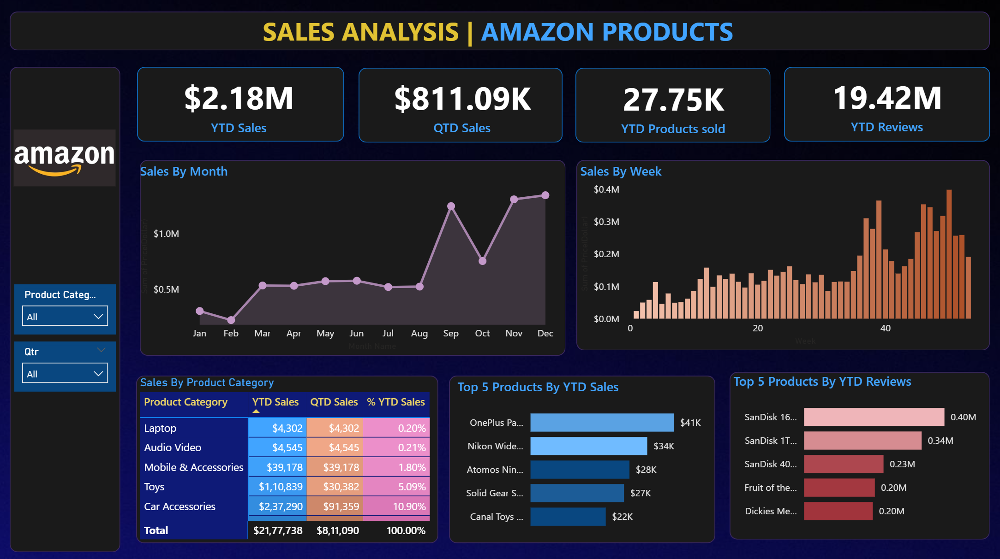

# 📊 Amazon Sales Analysis Dashboard – Power BI

---

## ✨ Project Summary

This project analyzes Amazon product sales and customer feedback using Power BI to uncover trends, identify high-performing products, and support data-driven decision-making.

---

## ✅ 1. Business Problem

Amazon’s business team lacked a clear and centralized view of sales performance and customer feedback across product categories.

This made it difficult to:

- Track sales trends over time  
- Identify top-performing and underperforming products  
- Understand customer preferences through reviews  
- Make informed decisions related to marketing and inventory  

---

## ✅ 2. Goal of the Dashboard

The goal of this project is to build an interactive Power BI dashboard that:

- ✔ Tracks **Year-to-Date (YTD)** and **Quarter-to-Date (QTD)** sales  
- ✔ Identifies **top-performing products and categories**  
- ✔ Analyzes **customer feedback using review data**  
- ✔ Provides insights into **sales trends over time**  

---

## ✅ 3. Tech Stack

- **Power BI Desktop** – Data visualization & dashboard creation  
- **DAX (Data Analysis Expressions)** – Calculated measures  
- **Power Query Editor** – Data cleaning & transformation  
- **Excel / CSV** – Data source  
- **Data Modeling** – Relationships between tables  
- **Charts Used** – Line, Column, Bar, Table  
- **Filters & Slicers** – Interactive exploration  

---

## ✅ 4. Data Source

The dataset used in this project is a publicly available sample dataset representing Amazon product sales, categories, and customer reviews. It includes transaction-level data used to simulate real-world business analysis scenarios.

📁 *Dataset is included in this repository for analysis and reproducibility.*

---

## ✅ 5. Data Cleaning & Preparation

- Removed null and duplicate values  
- Converted data types (Date, Numeric)  
- Created a **Date Table**  
- Established relationships between tables  
- Created derived columns (**Month, Week, Quarter**)  

---

## ✅ 6. Key Metrics (DAX)

The following DAX measures were created to analyze business performance:

```DAX
YTD Sales = TOTALYTD([Total Sales], Date[Date])

QTD Sales = TOTALQTD([Total Sales], Date[Date])

YTD Products Sold = TOTALYTD(SUM(Sales[Quantity]), Date[Date])

YTD Reviews = TOTALYTD(SUM(Reviews[Review Count]), Date[Date])

---

## ✅ 7. Dashboard Features

- KPI Cards for quick overview  
- Monthly sales trend (**Line Chart**)  
- Weekly sales analysis (**Column Chart**)  
- Category-wise sales analysis (**Table**)  
- Top 5 products by sales (**Bar Chart**)  
- Top 5 products by reviews (**Bar Chart**)  

---

## ✅ 8. Key Insights

- 📈 Sales show upward trend in later months indicating seasonal growth  
- 🛒 Categories like **Men’s Shoes and Cameras** drive major revenue  
- 📉 Some categories underperform, indicating optimization opportunity  
- ⭐ Products with high reviews indicate strong customer satisfaction  
- 📊 Weekly trends reveal short-term fluctuations in sales  

---

## ✅ 9. Business Impact

- Helps identify **high-performing products**  
- Supports **inventory planning**  
- Improves **marketing targeting**  
- Enhances **customer satisfaction strategy**  
- Enables **data-driven decision-making**  

---

## ✅ 10. Dashboard Preview



---
